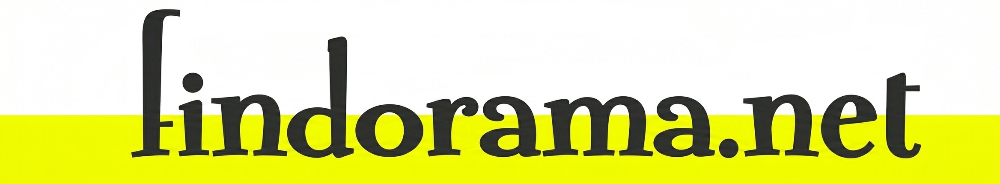

# Findorama.net 🌌 — Stargate SG-1 Prop Website Tribute

A faithful, retro-styled recreation of the fictional "Findorama" prop website featured in **Stargate SG-1**, Season 4, Episode 15: *"Chain Reaction"*. 

This project captures the peak early-2000s web aesthetic, accurately mimicking the Netscape Navigator environment and the iconic login page used by General Hammond and Harry Maybourne to expose the rogue NID operations.

🌐 **Live Demo:** [https://findorama.netlify.app/](https://findorama.netlify.app/)

---

## 📺 The Lore & The Joke

In the episode *"Chain Reaction"*, a secret website called **Findorama.net** is used as a front to store classified data. However, eagle-eyed tech fans and the Stargate community quickly noticed a hilarious technical oversight in the original broadcast: the address bar in the browser reveals that the "website" was actually just a local file running off the studio computer's hard drive:

`file:///C:/www.findorama.net.bin/login.html`

This project turns that beloved piece of television sci-fi prop history into a fully functional, pixel-perfect static web page tribute.

---

## 📸 Preview

### Recreated Tribute Page


---

## ✨ Features

- **Retro Aesthetic:** Implements the classic web design patterns of the late 90s and early 2000s.
- **Netscape Frame Styling:** Replicates the toolbars, buttons, and iconic logos of classic web browsers.
- **Lightweight & Pure:** Built using vanilla frontend technologies with zero external dependencies or heavy frameworks.
- **The Iconic URL:** Features the exact local file path Easter egg in the mock navigation bar.

---

## 🛠️ Built With

- **HTML5**
- **CSS3**

---

## 🚀 How to Run Locally

Since this is a lightweight static site, you can run it instantly without any build steps:

1. Clone this repository:
   ```bash
   git clone [https://github.com/hectrhcc/findorama.net.git](https://github.com/hectrhcc/findorama.net.git)

2. Navigate into the directory:

Bash
cd findorama.net

3. Open index.html in any modern web browser.

📜 License
This project is open-source and available under the MIT License.

Disclaimer: This is a non-commercial, fan-made tribute project. Stargate SG-1 and all related marks are trademarks of Metro-Goldwyn-Mayer Studios Inc.